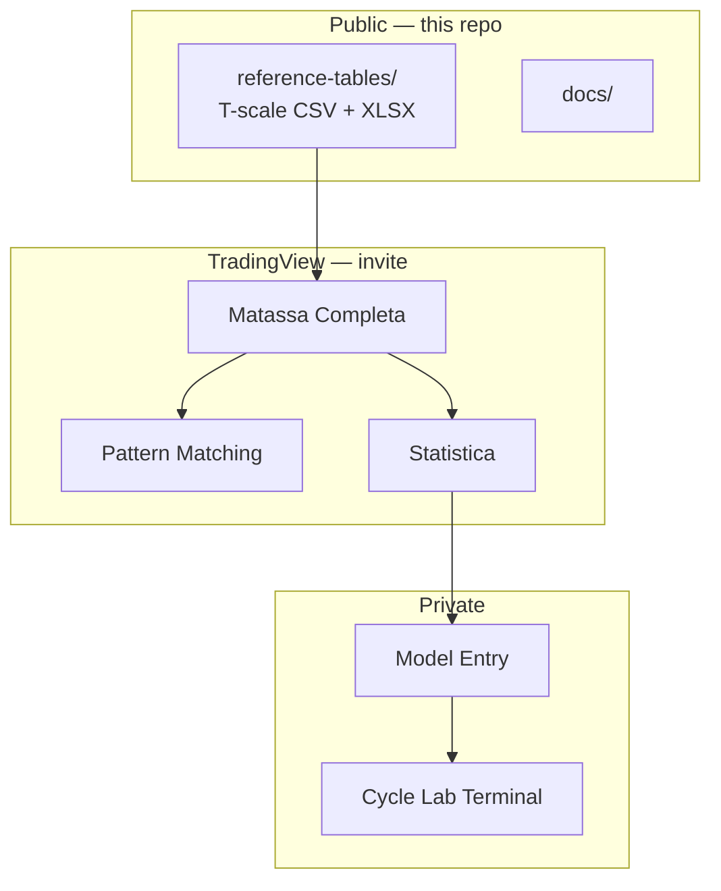

<!-- GIF animates on GitHub (SVG CSS animations are stripped by GitHub's image proxy) -->

 

  
  &nbsp;
  
  &nbsp;
  
  &nbsp;
  
  &nbsp;
  

<strong>Public reference layer</strong> for cyclical market analysis — optimized T-scale tables by market and length profile. 
Full <strong>Matassa Completa</strong> on TradingView is <strong>invite-only</strong>. No indicator source code in this repo.

 

## Architecture

| Layer | Access | Contents |
|-------|--------|----------|
| **Reference tables** | Public | MIN → MAX profiles · 6 market calibrations |
| **Matassa Completa** | [TV invite](https://www.tradingview.com/u/AnDr3HA/) | Pivots · FLD/FEMA · swings · multi-cycle |
| **Advanced modules** | Private / screenshots | Pattern · statistics · strategy |
| **Cycle Lab** | Private product | Execution · terminal · backtest |

 

## What's included

| Asset | Description |
|-------|-------------|
| [`reference-tables/`](reference-tables/) | T-scale duration tables (5 profiles × 6 markets) |
| [`docs/framework-overview.md`](docs/framework-overview.md) | Stack overview |
| [`docs/using-reference-tables.md`](docs/using-reference-tables.md) | How to read the tables |
| [`assets/screenshots/`](assets/screenshots/) | TradingView previews (images only) |

### Length profiles

| Profile | Factor | Use when |
|---------|--------|----------|
| `min-0-6875x` | 0.6875× | Cycles compress / high volatility |
| `c-0-75x` | 0.75× | Slightly short bias |
| **`m-1-0x`** | **1.0×** | **Default baseline** |
| `l-1-25x` | 1.25× | Extended harmonics |
| `max-1-4375x` | 1.4375× | Slow / stretched regimes |

Markets: **Crypto (100%)** reference · Futures/Forex · Forex · Futures · Stock US · Stock EU.

→ Start with [`reference-tables/m-1-0x.csv`](reference-tables/m-1-0x.csv)

 

## Visual preview (TradingView)

Screenshots only — **no Pine source**. Full suite: [@AnDr3HA](https://www.tradingview.com/u/AnDr3HA/) (invite-only).

### Matassa Completa
Pivots, centratura, FLD/FEMA, cycle bands, multi-timeframe targets.

### Matassa 3 Cicli
Three synchronized cycle layers (+2 / 0 / -2) on one chart.

### Matassa Statistica
Statistical projections, heatmap distribution, accuracy tables.

### Matassa Pattern Matching
Historical shape matching (KNN / DTW), similarity ranking, walk-forward backtest.

 

## Quick start

1. Open [`reference-tables/m-1-0x.csv`](reference-tables/m-1-0x.csv).
2. Pick your market column (e.g. `CRYPTO (100%)`).
3. Read [`docs/using-reference-tables.md`](docs/using-reference-tables.md).

## Request access

- **TradingView:** [@AnDr3HA](https://www.tradingview.com/u/AnDr3HA/) — [andreafinazzi.com](https://andreafinazzi.com) · [email](mailto:andrea.finazzi.info@gmail.com)
- **Cycle Lab terminal:** via website

## License

Reference tables: [LICENSE](LICENSE) — personal / educational use. No commercial redistribution without permission.

 

**Andrea Finazzi** — Quantitative Architect

[Profile](https://github.com/andreafinazziinfo) · [matassa-cycle-framework](https://github.com/andreafinazziinfo/matassa-cycle-framework) · [claude-statusline-pro](https://github.com/andreafinazziinfo/claude-statusline-pro)

